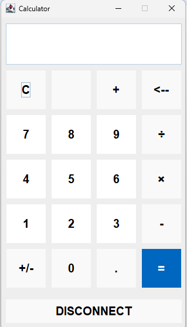

# Network-Socket-Calculator
- 자바의 Socket API를 활용한 계산기입니다.
- 응용계층에서 사용되는 프로토콜을 정의하여 사용합니다.


## 실행방법

1. 해당 레포지토리를 로컬로 clone합니다.
```
git clone https://github.com/SeojunKim-pumisj/Network-Socket-Calculator
```
2. Eclipse를 실행 > File > import > Existing Projects into Workspace를 선택합니다.
3. Root Directory에 클론한 폴더를 선택합니다.
4. 'CalculatorServer.java'를 실행합니다.
5. 'CalculatorClient.java'를 실행합니다.

## 사용법
| 실행 화면 | 설명 |
| --------- | ---------- |
||C : 전체 지우기 <br> <-- : 하나씩 지우기 <br>+ \| - \| ÷ \| × : 사칙연산자 <br> +/- : 부호 <br> . : 소수점 <br> = : 서버에 프로토콜 전송 <br> DISCONNECT : 서버와 연결 종료

한 수식에 하나의 연산자만 사용 가능하며, 피연산자는 최대 2개를 입력할 수 있습니다.

## 프로토콜
클라이언트는 서버에 다음과 같이 전송합니다.
```
<method> <operand1> <operand2>
```
| Method | 설명 |
|--------|--------|
|ADD| 피연산자를 더한다|
|SUB| 피연산자를 뺀다|
|MUL| 피연산자를 곱한다|
|DIV| 피연산자를 나눈다|
|DISCONNECT| 서버와의 연결 종료|

서버는 클라이언트에 다음과 같이 전송합니다.
```
<method> <field>
```
| Method | 설명 |
|--------|--------|
|ANSWER| 계산 결과를 field에 담아 보낸다|
|ERROR| 에러 코드를 field에 담아 보낸다|

| Error Code | 설명 |
|--------|--------|
|1| 인자 개수 오류|
|2| 존재하지 않는 method|
|3| 0으로 나눔|
|4| 존재하지 않는 수식|
|5| 인자 형식 오류|